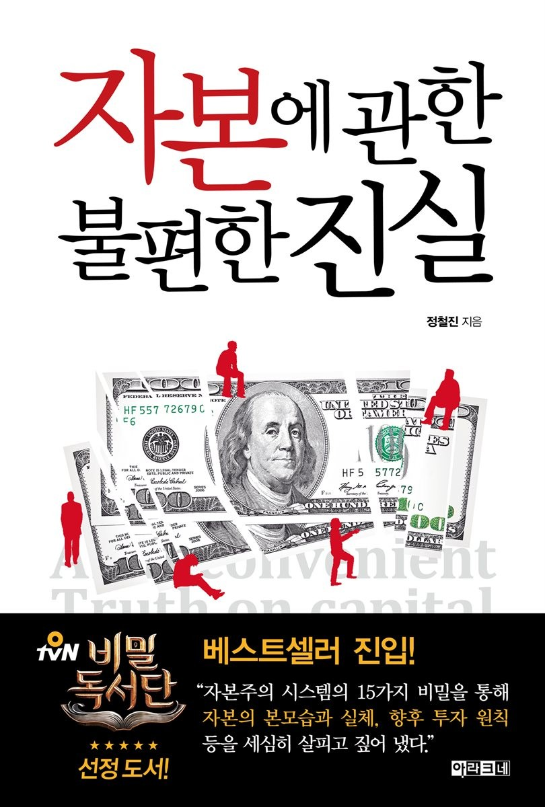

안녕하세요 꿈이입니다. 

자본주의 경제에 역사적인 근간, 발전해온 과정등을 이야기 해보면
하루 종일 진행해도 끝이 없을 겁니다. 

이번 포스팅에서는 지극히 제 개인적인 생각을 기준으로 자본주의 경제가 돌아가는 
매커니즘에 대해서 이야기 해보고자 합니다. 

좀 더 정확한 정보와 이야기를 듣고 싶다면
2012년 EBS에서 방송한 EBS Docuprime_자본주의 [EBS Docuprime_자본주의] (https://www.youtube.com/watch?v=wazpnHmfqJM,"EBS docuprime") 을 시청하시면 좋을 것 같습니다.
조금 오래되긴 했어도 정리가 잘되고 알기 쉽게 설명되어 있어서 추천드립니다. 

자본주의는 결국 끊임 없이 사람들을 움직이게 하는 구조를 가지고 있습니다. 
제가 생각하는 자본주의의 핵심은 전체 시장에 있는 돈보다 빚이 많다는 점입니다. 

각국의 정부는 은행을 통해 화폐를 공급하는데
별거 아니라고 생각하는 "이자, interest" 이 녀석이 자본주의를 굴러가게 합니다.  
** 시장에 있는 돈은 100원이지만 은행은 이자를 포함해서 110원을 갚으라고 합니다.**

각각 개개인의 한명으로 보면 빚이 없는 사람도 있을 것입니다. 하지만 시장 전체로 보았을때는
빚이 있는 사람이 더 많을 수 밖에 없는 상황입니다. 
빚이 있는 사람은 무언가를 해서 빚을 갚아야 합니다. 노동에서 자유로울 수 없죠.

더 어려운 경제적인 상황과 개념(은행, 채권, 이자, M1, M2) 들은 많을 수 있지만 핵심은 위의 내용인 것 같습니다. 

인류의 역사를 500만년으로 보았을때 자본주의가 진행된 시간은 하루 밖에 되지 않는다고 합니다. 

이전에는 노예 제도와 신분 제도였죠.

저는 자본주의가 오랜 노예 제도와 신분 제도에서 발생하는 문제점을 극복하기 위한
지배층과 피지배층의 타협에 의해 생겨난 제도라고 생각합니다. 

노예 제도와 신분 제도는 한계가 명확합니다. 태어났을때부터 결정되고 특별한 경우를 제외하고는
변경할 수 없습니다. 전쟁, 기아, 천재지변이 발생해서 극한 상황이 발생하면 피지배층은 분노를
표출할 대상이 명확합니다. 바로 지배층이죠. 그래서 아무리 강성한 제국과 국가도 결국에는 쇠퇴의 길을 걷고 마지막에는 반란을 통해 새로운 제국과 국가가 형성되는것을 인류 역사에 하루를 제외하고
전체 기간에서 일어났습니다.

제 생각에 결국 인류 체계가 타협을 본 제도가 자본주의, 시장 경제 제도인 것 같습니다. 

자본 주의는 돈이라는 매체와 이자를 통해 사람을 움직이게 합니다. 
개인에게 무언가 문제가 생겼을때 원망해야할 대상은 돈이 되겠죠.
돈 한테는 화를 낼 수 없습니다. 결국 자신의 무능력함으로 그 대상이 전이됩니다. 

그래서 우리는 돈을 두려워해야 합니다. 자본주의 제도를 깊게 이해하고, 경제에 관심을 갖어야 합니다. 돈을 두려워하되 특성과 성격을 이해하고 어떻게 하면 자본주의와 어울려서
살아갈 수 있는지 고민하고 행동해야 합니다.

자본에 관한 불편한 진실 책도 한번 읽어 보시면 좋을 것 같습니다. 

감사합니다.!

